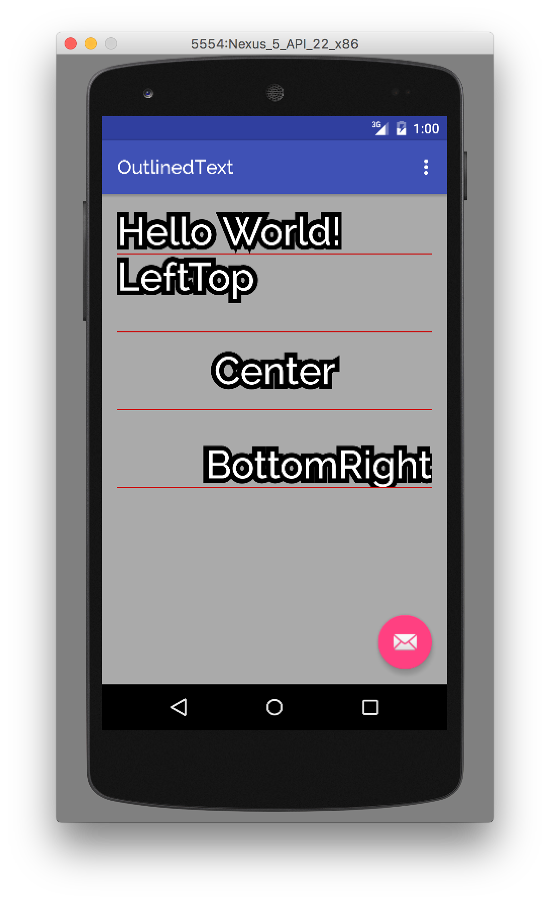

# OutlinedText [](https://maven-badges.herokuapp.com/maven-central/me.mattak/outlined-text) [](https://travis-ci.org/mattak/OutlinedText)

## Install

Android simple outlined TextView library.

# Install

```groovy
compile 'me.mattak:outlined-text:0.0.1'
```

# Usage

You can set strokeColor and strokeWidth.

```xml
<me.mattak.outlined_text.OutlinedTextView
    android:layout_width="match_parent"
    android:layout_height="80dp"
    android:text="LeftTop"
    android:textColor="@android:color/white"
    android:textSize="40sp"
    app:strokeColor="@android:color/black"
    app:strokeWidth="10sp" />
```


